<div align="center">
    
    <h1>Ricardo Alexandro Mena</h1>
    <h3>💻 Software Developer | ⚖️ Lawyer</h3>
</div>

<p align="center">
    
</p>

## 👨‍💻 About Me

Passionate about creating innovative and personalized technological solutions, I combine my experience as a lawyer and entrepreneur with my dedication to software development. This unique blend allows me to deeply understand customer needs and translate them into impactful applications that drive business success.


## 🛠️ Technical Skills  

### Programming Languages & Tools

<div align="left">
    
    
    
    
    
</div>

<div align="left">
    
    
    
    
</div>

## 💡 Professional Skills

```javascript
const ricardoMena = {
    technicalSkills: {
        frontEnd: ['React', 'Next.js', 'HTML5', 'CSS3', 'JavaScript'],
        backEnd: ['Node.js', 'PHP', 'SQL'],
        versionControl: ['Git', 'GitHub'],
        tools: ['VSCode', 'Postman', 'npm']
    },
    softSkills: [
        '💬 Effective Communication',
        '🤝 Team Leadership',
        '🧠 Critical Thinking',
        '⏰ Time Management',
        '🔄 Adaptability'
    ],
    languages: {
        spanish: 'Native',
        english: 'B1'
    },
    currentlyLearning: [
        'Advanced React Patterns',
        'System Architecture',
        'Cloud Solutions'
    ],
    passions: ['Technology', 'Innovation', 'Problem Solving']
};
```

<h2 align="center">📫 Let's Connect & Collaborate!</h2>

<p align="center">
    📧 Email: <a href="mailto:ricardoamena@gmail.com">ricardoamena@gmail.com</a><br>
    🔗 LinkedIn: <a href="https://www.linkedin.com/in/ricardo-alexandro-mena-956a92257">Ricardo Mena</a><br>
    🌐 Website: <a href="https://www.ricardoamena.com">ricardoamena.com</a>
</p>

<div align="center">
    <h3>🚀 Let's create something amazing together! 🚀</h3>
    <p>I'm always open to interesting collaborations and innovative projects.</p>
</div>
